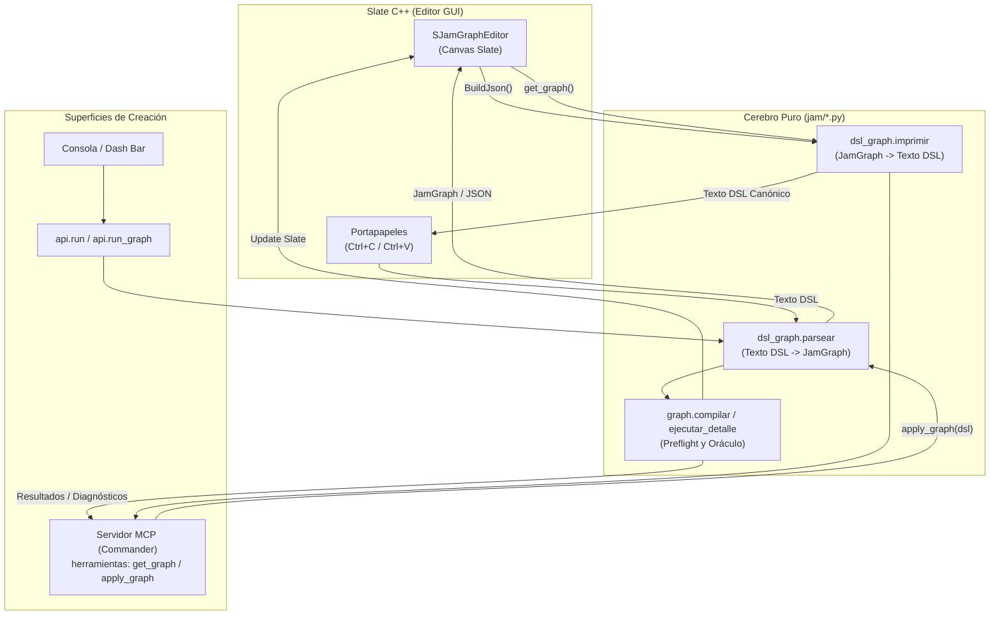

# Propuesta de Diseño: JamGraph DSL (Superficie Canónica para Creación Híbrida LLM ↔ Humano)

---

## 1. Definición Formal de «El Mismo Grafo» y Criterio de Ida y Vuelta Exacta

Para garantizar una biyección estricta ($Texto \leftrightarrow Grafo$), se define la equivalencia formal de grafos bajo las siguientes reglas:

1. **Topología e Identidad Semántica:** Dos grafos son equivalentes si poseen el mismo conjunto de nodos con idénticos identificadores legibles, mismos verbos, idénticas banderas operativas (`bypass`, `debug`, `compact`) y el mismo conjunto de aristas `(origen, origen_pin, destino, destino_pin)`.
2. **Orden de Cables Variádicos:** En pines con `aridad == -1` ([graph.py:462](file:///home/workstation/Dev/jam/Content/Python/jam/graph.py#L462), ej. `mesh_merge` o `merge`), **el orden de las conexiones importa estrictamente**, pues define la lista `valores_main` que consume el ejecutor ([graph.py:821-831](file:///home/workstation/Dev/jam/Content/Python/jam/graph.py#L821-L831)). En pines de aridad fija (aridad 1), un pin sólo admite un único cable ([graph.py:464](file:///home/workstation/Dev/jam/Content/Python/jam/graph.py#L464)).
3. **Parámetros vs. Defaults:** En la forma canónica, **un parámetro cuyo valor efectivo sea estrictamente igual a su default declarado en el registro ([tools.py](file:///home/workstation/Dev/jam/Content/Python/jam/tools.py) o [flow.py](file:///home/workstation/Dev/jam/Content/Python/jam/flow.py)) y que no esté cableado, se omite**. Al deserializar hacia `JamGraph` o Slate, los parámetros omitidos se rellenan con su valor por defecto tipado. Esto reduce en un ~70% la sobrecarga de tokens para el LLM y elimina ruido en diffs.
4. **Tipado vs. Strings Crudos:** Slate almacena internamente todo parámetro como `FString` ([SJamGraphEditor.cpp:4234](file:///home/workstation/Dev/jam/Source/JamEditor/Private/SJamGraphEditor.cpp#L4234)), lo que originó el descarte silencioso en `dsl.coaccionar` ([AUDITORIA.md:21](file:///home/workstation/Dev/jam/tareas/20260924-114746-dsl-llm/AUDITORIA.md#L21)). En el DSL, **los valores son fuertemente tipados** en sintaxis (números, booleanos, strings entrecomillados, tuplas de vectores). El descompilador emite el tipo según el default de `tools.REGISTRO`; el compilador del DSL formatea hacia el JSON intermedio sin ambigüedad de representación.
5. **Idempotencia Canónica:** 
   - $Texto \xrightarrow{parse} Grafo \xrightarrow{print} Texto$ devuelve idéntico texto canónico carácter por carácter.
   - $Grafo \xrightarrow{print} Texto \xrightarrow{parse} Grafo$ produce idéntico estado ejecutable y estructural.

---

## a. La Gramática EBNF

```ebnf
Documento     ::= { Elemento EOL } [ LayoutBlock ]
Elemento      ::= NodoDecl | ComentarioDecl

NodoDecl      ::= Identificador ":" WS Verbo [ WS Flags ] EOL { Indent Atributo EOL }
Verbo         ::= Identificador | "fn:" Identificador
Flags         ::= "[" Flag { ( "," | WS ) Flag } "]"
Flag          ::= "bypass" | "debug" | "compact"

Atributo      ::= PinName WS "=" WS Valor
PinName       ::= Identificador
Valor         ::= Literal | Expresion | Cable | ListaCables

Cable         ::= Identificador [ "." Identificador ]
ListaCables   ::= "[" WS [ Cable { WS "," WS Cable } ] WS "]"
Expresion     ::= "=" ExprCaract
Literal       ::= Numero | Booleano | Cadena | Vector | Dominio | Matriz

Numero        ::= ["-"] DIGIT+ [ "." DIGIT+ ] [ ("e"|"E") ["+"|"-"] DIGIT+ ]
Booleano      ::= "true" | "false"
Cadena        ::= '"' [^"\\]* '"'
Vector        ::= "(" WS Numero WS "," WS Numero WS "," WS Numero WS ")"
Dominio       ::= "(" WS Numero WS "," WS Numero WS ")"
Matriz        ::= "matrix(" WS Numero { WS "," WS Numero }15 WS ")"

ComentarioDecl::= "comment" WS Identificador WS Cadena WS ":" WS Box2D [ WS ColorHex ]
Box2D         ::= "(" WS Numero WS "," WS Numero WS "," WS Numero WS "," WS Numero WS ")"
ColorHex      ::= "#" HEXDIGIT{6}

LayoutBlock   ::= "layout:" EOL { Indent Identificador WS ":" WS Point2D EOL }
                  [ "reroutes:" EOL { Indent Cable WS "->" WS Cable WS ":" WS Point2D { WS "," WS Point2D } EOL } ]
Point2D       ::= "(" WS Numero WS "," WS Numero WS ")"
Identificador ::= [A-Za-z_][A-Za-z0-9_]*
Indent        ::= "    "
```

*Reglas léxicas clave:*
- Identificador sin comillas ni punto = cable al pin `out` de ese nodo (ej. `in = polyline`).
- Identificador con punto = cable a pin específico (ej. `profile = trunk_pipe.profile` o `descomp.traslacion`).
- String siempre con comillas dobles (`"SM_Rock"`).
- Expresión inicia con `=` ([graph.py:322](file:///home/workstation/Dev/jam/Content/Python/jam/graph.py#L322)).

---

## b. Los Dos Ejemplos Reales Transcritos Enteros

### 1. `Resources/Examples/Cylinder-Strip.jamgraph`

```jam
x: series_range
    start = 0.0
    end = 720.0
    count = 7

y: graph_curve
    start_value = 0.0
    end_value = 0.0
    shape = "custom"
    power = 2.0
    midpoint = 0.48
    mid_value = 240.0
    samples = 7

z: graph_curve
    start_value = 0.0
    end_value = 180.0
    shape = "custom"
    power = 2.0
    midpoint = 0.62
    mid_value = -80.0
    samples = 7

polyline: curve_polyline
    x = x
    y = y
    z = z

smooth: curve_smooth
    in = polyline
    iterations = 3
    strength = 0.45
    preserve_ends = true
    samples = 32

uniformar: curve_resample
    in = smooth
    count = 31
    samples = 32

pipe: mesh_pipe
    in = uniformar
    radius_start = 26.0
    radius_end = 26.0
    sides = 12
    samples = 32
    capped = true
    profile_rotation = 0.0
    miter_limit = 2.5
    radius_from_parent = 0.0
    pivot_uvs = false

normals: mesh_normals
    in = pipe
    angle_weighted = true
    area_weighted = true

hornear: mesh_to_static
    in = normals
    name = "SM_JamCylinderStrip"
    folder = "/Game/Jam/Meshes"
    collision = true
    recompute_tangents = true
    show_vertex_colors = true

colocar: place
    in = hornear
    x = 0.0
    y = 0.0
    z = 0.0
    view = true
    surface = true
    anchor = "base"
    sink = 0.0
    align = false
    yaw = 0.0
    scale = 1.0

layout:
    colocar: (2280, 290)
    hornear: (1960, 290)
    normals: (1640, 290)
    pipe: (1320, 290)
    polyline: (360, 290)
    smooth: (680, 290)
    uniformar: (1000, 290)
    x: (40, 40)
    y: (40, 290)
    z: (40, 540)
```

---

### 2. `Resources/Examples/TreeGen-Curve-Frames.jamgraph`

```jam
curve: curve_bezier
    start_x = 0.0
    start_y = 0.0
    start_z = 0.0
    end_x = 40.0
    end_y = 0.0
    end_z = 600.0
    bend_x = 80.0
    bend_y = 30.0
    bend_z = 0.0
    segments = 16

frames: curve_frames
    in = curve
    count = 12
    start = 0.1
    end = 0.95
    radial_offset = 18.0
    turns = 2.0
    angle_offset = 0.0
    radius_start = 55.0
    radius_end = 8.0
    samples = 32
    seed = 1977

distribute: distribute_frames
    in = frames
    count = 18
    start = 0.15
    end = 0.92
    rotate_per_index = 137.5
    angle_offset = 0.0
    angle_jitter = 6.0
    parameter_jitter = 0.02
    seed = 1977

transform: transform_frames
    in = distribute
    offset_x = 0.0
    offset_y = 0.0
    offset_z = 12.0
    pitch = 8.0
    yaw = 0.0
    roll = 0.0
    scale = 0.85
    offset_jitter_x = 6.0
    offset_jitter_y = 4.0
    offset_jitter_z = 3.0
    pitch_jitter = 5.0
    yaw_jitter = 8.0
    roll_jitter = 12.0
    scale_jitter = 0.12
    inherit_scale = true
    seed = 1977

branches: branch_from_frames
    in = transform
    length_min = 180.0
    length_max = 300.0
    angle = 62.0
    angle_jitter = 8.0
    curl = 28.0
    curl_jitter = 12.0
    segments = 10
    inherit_scale = true
    seed = 1977

trunk_profile: graph_curve
    start_value = 1.0
    end_value = 0.24
    shape = "custom"
    power = 2.0
    midpoint = 0.58
    mid_value = 0.72
    samples = 17

trunk_pipe: mesh_pipe_profile
    in = curve
    profile = trunk_profile
    radius = 52.0
    sides = 12
    samples = 24
    capped = true
    profile_rotation = 0.0
    miter_limit = 4.0

branch_profile: graph_curve
    start_value = 1.0
    end_value = 0.1
    shape = "ease_in"
    power = 1.8
    midpoint = 0.5
    mid_value = 0.65
    samples = 13

branch_pipe: mesh_pipe_profile
    in = branches
    profile = branch_profile
    radius = 12.0
    sides = 7
    samples = 12
    capped = true
    profile_rotation = 0.0
    miter_limit = 4.0

merge: mesh_merge
    in = [trunk_pipe, branch_pipe]

color: mesh_color
    in = merge
    color = "#76502F"

wood_uv: mesh_uv_scale
    in = color
    u = 2.0
    v = 6.0
    channel = 0
    origin_u = 0.0
    origin_v = 0.0

wood_material: mesh_material
    in = wood_uv
    material = "/Engine/EngineDebugMaterials/VertexColorMaterial.VertexColorMaterial"

normals: mesh_normals
    in = wood_material
    angle_weighted = true
    area_weighted = true

tree_asset: mesh_to_static
    in = normals
    name = "TreeGen_FrameFlow_Test"
    folder = "/Game/Jam/Meshes"
    collision = true
    recompute_tangents = true
    show_vertex_colors = false

preview: place
    in = tree_asset
    asset = ""
    x = 0.0
    y = 0.0
    z = 0.0
    view = false
    surface = false
    anchor = "base"
    sink = 0.0
    align = false
    yaw = 0.0
    scale = 1.0

frond_asset: asset
    name = "PineFrond"

leaf_card_asset: asset
    name = "/Engine/BasicShapes/Plane.Plane"

foliage_set: asset_set
    in = [frond_asset, leaf_card_asset]

foliage_choose: choose_asset
    in = transform
    assets = foliage_set
    mode = "random"
    seed = 3107

foliage: hism_output
    in = foliage_choose
    name = "TreeGen_Foliage"
    asset_offset_x = 0.0
    asset_offset_y = 0.0
    asset_offset_z = 0.0
    asset_pitch = 0.0
    asset_yaw = 0.0
    asset_roll = 0.0
    asset_scale = 1.0
    inherit_scale = true

layout:
    branch_pipe: (1670, 40)
    branch_profile: (1340, 300)
    branches: (1340, 40)
    color: (2250, 280)
    curve: (30, 40)
    distribute: (680, 40)
    foliage: (1670, 900)
    foliage_choose: (1340, 900)
    foliage_set: (1010, 900)
    frames: (350, 40)
    frond_asset: (1010, 760)
    leaf_card_asset: (680, 960)
    merge: (2000, 280)
    normals: (3000, 280)
    preview: (3520, 280)
    transform: (1010, 40)
    tree_asset: (3250, 280)
    trunk_pipe: (1340, 540)
    trunk_profile: (1010, 540)
    wood_material: (2750, 280)
    wood_uv: (2500, 280)
```

---

## c. Ejemplo Propio Completo

Este ejemplo demuestra:
1. Pin de salida extra (`matrix_decompose.traslacion` y `matrix_decompose.eje_x`, ver [math_core.py:1175](file:///home/workstation/Dev/jam/Content/Python/jam/math_core.py#L1175), [graph.py:189-213](file:///home/workstation/Dev/jam/Content/Python/jam/graph.py#L189-L213)).
2. Nodo de valor (`number`) cableado al parámetro de una tool.
3. Expresión dependiente de variable (`=pasos * 20.0`, resuelta vía `math_core.resolver`, [graph.py:322](file:///home/workstation/Dev/jam/Content/Python/jam/graph.py#L322)).
4. Instancia de función de subgrafo (`fn:generar_capitel`, [funcion.py:29-68](file:///home/workstation/Dev/jam/Content/Python/jam/funcion.py#L29-L68)).
5. Nodo con bandera `[bypass]` ([graph.py:503-513](file:///home/workstation/Dev/jam/Content/Python/jam/graph.py#L503-L513), [graph.py:839-845](file:///home/workstation/Dev/jam/Content/Python/jam/graph.py#L839-L845)).

```jam
pasos: number
    value = 8.0

altura_base: number
    value = =pasos * 20.0

transf_base: matrix_construct
    traslacion = (0.0, 0.0, 150.0)
    rotacion = (0.0, 0.0, 45.0)
    escala = (1.0, 1.0, 1.0)

descomp: matrix_decompose
    matriz = transf_base

fuste: curve_line
    desde = descomp.traslacion
    hasta = (0.0, 0.0, 500.0)

columna_mesh: mesh_pipe
    in = fuste
    radius_start = 30.0
    radius_end = 25.0
    sides = pasos

capitel: fn:generar_capitel
    in = columna_mesh
    ancho = 60.0

simplificar: mesh_simplify_count [bypass]
    in = capitel
    target_count = 500

colocar_escena: place
    in = simplificar
    surface = true

layout:
    altura_base: (40, 180)
    capitel: (980, 40)
    columna_mesh: (680, 40)
    colocar_escena: (1580, 40)
    descomp: (360, 40)
    fuste: (500, 40)
    pasos: (40, 40)
    simplificar: (1280, 40)
    transf_base: (40, 320)
```

---

## d. Reglas del Impresor Canónico (`jam format`)

Para que el formateador opere de forma determinista y estable:

1. **Orden de Nodos:**
   - Se ordenan estrictamente mediante ordenamiento topológico ([JamGraph.topo_order](file:///home/workstation/Dev/jam/Content/Python/jam/graph.py#L92-L111)).
   - Nodos independientes en el mismo nivel topológico se desempatan deterministamente por: `Pos.X`, luego `Pos.Y`, luego orden alfabético de `Id`.
2. **Orden de Atributos por Nodo:**
   - 1º: Pin de flujo principal `in` (o lista `in = [...]` si es variádico).
   - 2º: Pin de asset `asset` (si la herramienta declara `asset_row`, [graph.py:281](file:///home/workstation/Dev/jam/Content/Python/jam/graph.py#L281)).
   - 3º: Pines de parámetros alfabéticamente por nombre de parámetro.
3. **Poda de Parámetros Idénticos a Default:**
   - Si un parámetro no está cableado y su valor actual coaccionado coincide con `REGISTRO[verbo]["params"][pin]`, **se omite**.
   - Si está cableado, se imprime obligatoriamente `pin = origen` o `pin = origen.salida`.
4. **Formateo de Valores y Tipos:**
   - **Flotantes y Enteros:** se formatea con `f"{v:.6g}"` para evitar ruido de precisión binaria (siguiendo la regla de oro de [math_core.py:1197-1200](file:///home/workstation/Dev/jam/Content/Python/jam/math_core.py#L1197-L1200)).
   - **Vectores:** siempre `(x, y, z)` con espacio tras la coma.
   - **Cables:** cuando se conecta al pin principal `out`, se omite el sufijo `.out` (`in = smooth` en lugar de `in = smooth.out`), conservando la convención limpia. Para salidas extra, el sufijo es obligatorio (`descomp.traslacion`).
5. **Sección `layout:`:**
   - Se ubica al final tras una línea en blanco.
   - Los identificadores se ordenan alfabéticamente.
   - Coordenadas redondeadas a enteros: `<id>: (X, Y)`.
   - Si el archivo original carecía de `layout:`, el impresor emite las coordenadas calculadas por el layout determinista automático.

---

## e. Edición Típica del Humano en Slate y su Diff Resultante

Supongamos que en `Cylinder-Strip`, el humano inserta un nodo `curve_subdivide` entre `smooth` y `uniformar`, cambia la cantidad de iteraciones en `smooth` a 5 y mueve visualmente `uniformar`:

### El Diff en Git:
```diff
 smooth: curve_smooth
     in = polyline
-    iterations = 3
+    iterations = 5
     strength = 0.45
     preserve_ends = true
     samples = 32

+subdiv: curve_subdivide
+    in = smooth
+    cuts = 2
+
 uniformar: curve_resample
-    in = smooth
+    in = subdiv
     count = 31
     samples = 32

 layout:
     colocar: (2280, 290)
     hornear: (1960, 290)
     normals: (1640, 290)
     pipe: (1320, 290)
     polyline: (360, 290)
     smooth: (680, 290)
+    subdiv: (840, 290)
-    uniformar: (1000, 290)
+    uniformar: (1080, 290)
     x: (40, 40)
```
*Evaluación:* Cero renombrado en cascada de `n1`, `n2`. Diffs semánticos, aislados por línea, legibles de inmediato para humanos y LLMs en revisiones de código.

---

## f. Tres Mensajes de Error con Número de Línea

Siguiendo el estándar de [sintaxis.py:75](file:///home/workstation/Dev/jam/vendor/oracle-pkg/oracle_metalenguaje/nucleo/sintaxis.py#L75) y los diagnósticos estructurados de [graph.py:438-446](file:///home/workstation/Dev/jam/Content/Python/jam/graph.py#L438-L446):

1. **Error de Tipos Incompatibles en Cable:**
   ```text
   línea 14, columna 10: tipo incompatible en conexión: «fuste.out» produce curva (S), pero «pipe.sides» espera un número (N).
   ```
2. **Parámetro Desconocido con Sugerencia (acorde a [registro_core.py:526](file:///home/workstation/Dev/jam/Content/Python/jam/graph.py#L526)):**
   ```text
   línea 22, columna 5: el verbo «mesh_pipe» no tiene un parámetro «cownt»; ¿quisiste decir «sides» o «samples»?
   ```
3. **Variable Inexistente en Expresión (acorde a [math_core.py:1330](file:///home/workstation/Dev/jam/Content/Python/jam/math_core.py#L1330)):**
   ```text
   línea 8, columna 13: la expresión «=radio_base * 2» usa «radio_base», que no es una variable declarada en el grafo; disponibles: «pasos», «altura_base».
   ```

---

## g. Arquitectura de Integración (Slate, API y Servidor MCP)



1. **En Slate C++ (`SJamGraphEditor.cpp` y `JamEditorModule.cpp`):**
   - Slate no necesita parsear el DSL. Continúa gestionando `FGNode`, `FGEdge` y widgets de Slate en C++.
   - `BuildJson()` ([SJamGraphEditor.cpp:4216](file:///home/workstation/Dev/jam/Source/JamEditor/Private/SJamGraphEditor.cpp#L4216)) alimenta a `dsl_graph.imprimir(json)` cuando el usuario copia (`Ctrl+C`) o cuando se guarda el archivo en disco (`.jamgraph`).
   - Al pegar (`Ctrl+V`), `JamEditorModule` detecta si el texto entrante es DSL (verificando la presencia de `: ` y saltos de línea). Si lo es, llama a `api.dsl_to_graph_json(texto)` y delega a `LoadGraphJson()` ([SJamGraphEditor.cpp:5115](file:///home/workstation/Dev/jam/Source/JamEditor/Private/SJamGraphEditor.cpp#L5115)).
   - **Generación de IDs legibles:** en `SJamGraphEditor.cpp:2259`, se reemplaza el fallback `n%d` por un slug derivado del verbo (`mesh_pipe` $\to$ `pipe`, `pipe_2` si colisiona), garantizando identificadores estables sin intervención manual.
2. **En la API de Python (`jam.api`):**
   - `api.graph_to_dsl(json_str: str) -> str`: invoca al serializador canónico.
   - `api.dsl_to_graph(dsl_str: str) -> str`: parsea DSL y devuelve el JSON estructurado para Slate.
   - `api.run(cmd)` ([api.py:66](file:///home/workstation/Dev/jam/Content/Python/jam/api.py#L66)):
     - Si el comando es una sola línea sin `:` y su primer token es un verbo de consola clásico (`scatter SM_Rock count=20`), corre el camino histórico de `panel.ejecutar_dsl` preservando el comando de consola (Criterio 6).
     - Si contiene saltos de línea o `:`, se compila como grafo y se ejecuta con `api.run_graph_json`.
3. **Servidor MCP (`jam-mcp` para Commander):**
   - Expone dos herramientas nucleares:
     - `get_active_graph() -> str`: devuelve el DSL canónico del canvas activo.
     - `apply_graph(dsl: str, run: bool = True) -> dict`: recibe texto DSL, lo valida mediante `graph.compilar`, actualiza el canvas de Slate y ejecuta el oráculo si `run=True`, devolviendo los diagnósticos línea por línea.

---

## h. Alternativas Descartadas y Análisis de Riesgos

### 1. La Mejor Alternativa Descartada: Sintaxis de Pipeline Tubería (`|` / `->`)
*Sintaxis considerada:*
```jam
polyline = curve_polyline(x=x, y=y, z=z) | curve_smooth(iterations=3) | curve_resample(count=31)
```
*Por qué se descartó:*
Aunque es atractiva para flujos 100% lineales (como filtros de imagen), **falla críticamente en grafos procedurales reales**:
- En `TreeGen-Curve-Frames`, `curve` alimenta simultáneamente a `frames` y a `trunk_pipe.in`.
- `trunk_pipe` y `branch_pipe` alimentan juntos a un pin variádico `mesh_merge.in`.
- Los modificadores de frames reciben conexiones accesorias (`trunk_profile` $\to$ `trunk_pipe.profile`).
Intentar meter un DAG complejo con bifurcaciones, puertos secundarios y uniones variádicas en una tubería horizontal requiere inventar operadores bizarros de bifurcación (`tee`, `split`, `merge`), destruyendo la legibilidad y provocando que un LLM alucine el orden de los cables. La asignación declarativa con indentación modela naturalmente cualquier DAG sin casos especiales.

### 2. Otra Alternativa Descartada: Python Scripting Nativo (`with JamGraph() ...`)
*Por qué se descartó:*
Un script en Python no tiene representación canónica biyectiva: admite bucles arbitrarios (`for i in range`), variables dinámicas y efectos secundarios que impiden la ida y vuelta exacta desde el canvas de Slate sin implementar un descompilador de AST de propósito general.

### 3. Riesgos de la Propuesta y sus Mitigaciones:
- **Riesgo 1: Colisión de IDs al renombrar nodos en el canvas.**
  *Mitigación:* El compilador del DSL rechaza identificadores duplicados antes de compilar ([graph.py:479](file:///home/workstation/Dev/jam/Content/Python/jam/graph.py#L479)). En Slate, `SJamGraphEditor` mantendrá un registro de nombres ocupados con sufijo numérico determinista (`curve_1`, `curve_2`).
- **Riesgo 2: Pérdida o desalineación de Layout si el LLM no genera la sección `layout:`.**
  *Mitigación:* Se implementa un layout automático determinista por niveles topológicos (algoritmo tipo Sugiyama simplificado: columnas ordenadas por profundidad del DAG y espaciadas uniformemente). Si el DSL carece de `layout:`, el canvas se despliega prolijo y ordenado automáticamente.
- **Riesgo 3: Desfase de valores por defecto si el registro evoluciona.**
  *Mitigación:* Los tests de regresión del oráculo (`test_oracle_embedding.py` y tests de `graph.py`) fijan los contratos de parámetros. Si un verbo cambia su default, el formateador canónico actualiza el texto de forma limpia.

---

## 9. Estimación de Implementación en Código

Todo el desarrollo se realiza en **cerebro puro** (`Content/Python/jam/`, cero `import unreal`):

| Archivo | Rol | Líneas Estimadas |
|---|---|---|
| `Content/Python/jam/dsl_graph.py` **(Nuevo)** | Tokenizador, Parser descendente recursivo (DSL $\to$ `JamGraph`) e Impresor canónico (`JamGraph` $\to$ DSL). | ~450 líneas |
| `Content/Python/jam/layout_core.py` **(Nuevo)** | Algoritmo determinista de layout automático para grafos sin bloque `layout:`. | ~120 líneas |
| `Content/Python/jam/graph.py` | Métodos helper `to_dsl()` y `from_dsl()` integrados con `JamGraph`. | ~35 líneas |
| `Content/Python/jam/api.py` | Endpoints `graph_to_dsl`, `dsl_to_graph` y redirección inteligente en `api.run`. | ~40 líneas |
| `Source/JamEditor/Private/SJamGraphEditor.cpp` | Soporte de copiar/pegar DSL en portapapeles y generación de slugs semánticos para nodos. | ~60 líneas |
| `Content/Python/tests/test_dsl_graph.py` **(Nuevo)** | Batería de tests de ida y vuelta exacta ($Texto \to Grafo \to Texto$ y $Grafo \to Texto \to Grafo$), validación de errores con línea y discriminación de mutantes. | ~350 líneas |
| **Total estimado** | | **~1055 líneas de código puro** |
